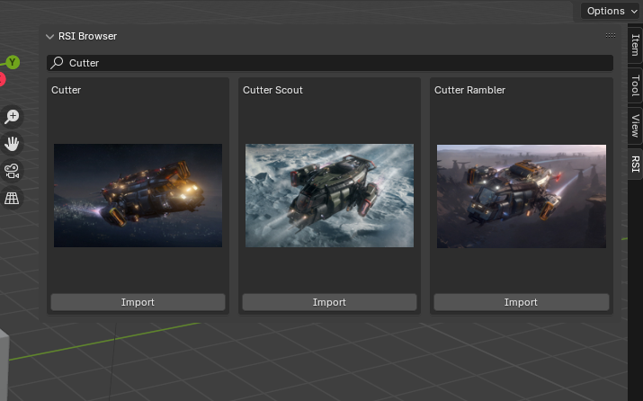
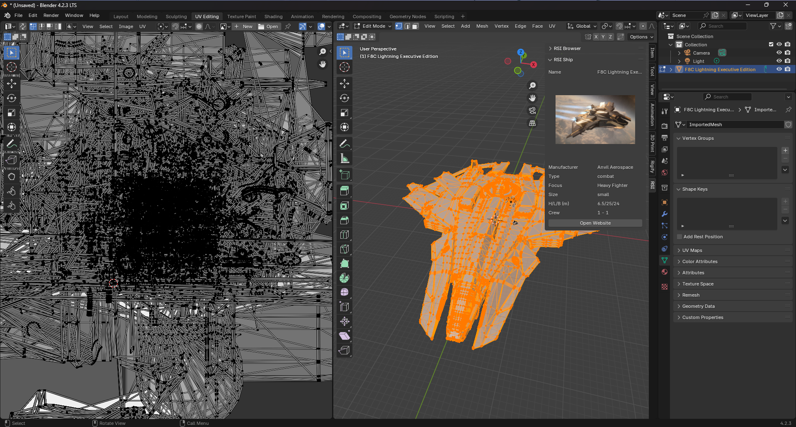

Blender RSI Browser
====================
Import 3D models from robertsspaceindustries.com into your scene!

Plugin requires [Import OpenCTM (.ctm)](https://github.com/RealIndrit/blender-openctm) plugin.
Note that CIG still owns the copyright for these models, you probably don't want to be using them commercially. I do
in no way endorse using this outside strictly personal and educational use. Any legal issues is on you as the user.



*Note: UV mapping might look weird, this is the raw UV data RSI uses for their ctm ship models...*

## Usage

- Downalod
   - Release tags here on [GitHub](https://github.com/RealIndrit/blender-rsi-browser/releases/tag/1.0.0)
- Install like any other blender plugin
- Search for ship and click import

Dev notes
---------
Blender 4.2.0 uses python 3.11 specifically, so use that to install bpy and create a virtualenv for if you want to have IDE autocompletions and such:
```
python3.11 -m venv venv
venv/bin/pip install bpy blender-stubs
```

Build the addon .zip file:
```
blender --command extension build
```

Install:
* blender -> edit -> preferences -> add-ons -> install from disk -> select the .zip file


Credits
-------
This plugin was heavily inspired by [Ikea Browser](https://github.com/shish/blender-ikea-browser/), go check it out!